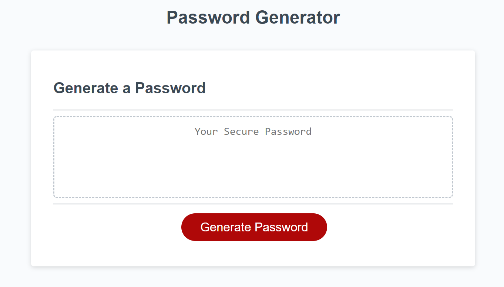

# Password Generator

Here I have modified starter code to create an application that enables employees to generate random passwords based on criteria that they’ve selected. This app will run in the browser and will feature dynamically updated HTML and CSS powered by JavaScript code that I've written. It will have a clean and polished, responsive user interface that adapts to multiple screen sizes.

The password can include special characters. 

As an employee with access to sensitive data, you will use this application to randomly generate a password that meets certain criteria
so that you can create a strong password that provides greater security.

# Function

-When you click the button to generate a password, you are presented with a series of prompts for password criteria.
-When you are prompted for password criteria,
then you select which criteria to include in the password.
-When you are prompted for the length of the password, you choose a length of at least 8 characters and no more than 128 characters.
-When you are prompted for character types to include in the password,
you then choose lowercase, uppercase, numeric, and/or special characters.
-When you answer each prompt, your input should be validated and at least one character type should be selected.
-When all the prompts are answered, a password is generated that matches the selected criteria.
-When your password is generated, the password is either displayed in an alert or written to the page.

# Screenshot

# Link to deployed application
* [GitHub Repository](https://github.com/EricaRoq/password-generator)

# Resources and contributers

-www.w3schools.com